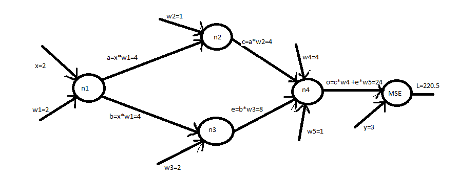
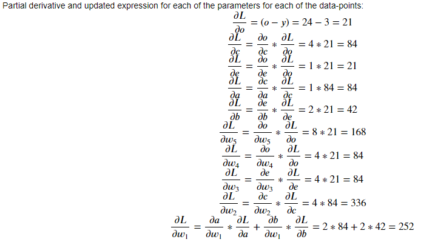
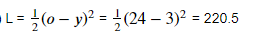
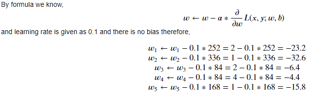

# Image classification using Convolutional Neural Network 

This project explain basics of backpropogation, concept of hidden layers and building a Convolutional neural network model for MNIST dataset. MNIST dataset is a collection of images of handwritten digits. The project tries to classify each image into its appropriate number from 0 to 9. 

But there is a little challenge in the end.. What is the challenge ? 
We also check the accuracy of the model by adding random 10 digits from the dataset to obtain the sum of those 10 digits. 
For example: adding numbers 1+2+3+4+5+6+7+8+9+0 should give us 45 right? So, We pick random digits from the MNIST datasets which have been classified as 0,1,2 till 9 and then take the sum of those digits to check if our generated model also provides the sum as 45. 
Therefore, testing the accuracy of the model, if the sum is more than 45 then our model overfitts the data, otherwise it underfits the data. 

1. [Backpropogation](#Backpropogation)
1. [Python Code for backpropogation](#Code_bp)
1. [Effects of Activation function and Hidden Layer](#Effect_AF_HL)

<a name="Backpropogation"/>

## Backpropogation
For a classification problem in supervised learning, the following illustrates a hand made graph for backpropogation. 
Considering it has single input e.g. x, (x is a pixel value that get fed into the neural network). The output neurons are typically the number of classes into which we classify the image. 
Loss funtion is the prediction of error of Nerual Net. Activation function defines the output of the node given a certain input to the node. Learning rate defines the step size, the rate at which the function moves to the local minima. 
Now, given that the learning rate is 0.1, activation function ReLU, a loss function of MSE (mean square error) we see the computation behind a backpropogation. 



That is how the backpropogation in neural network adjusts weights of each during each epoch to finally obtain the classification. 

The implemetation of nodes for a computation graph. Each node has a forward pass and a backward pass function, allowing for the evaluation and backpropagation of data. The code can be seen as follows: 

<b name="Code_bp"/>

## Python Code for backpropogation 

```python
from abc import ABC, abstractmethod
import math
import time


class Node(object):

    def __init__(self, inputs):
        self.inputs = inputs

    @abstractmethod
    def forward(self):
        ''' Feed-forward the result '''
        raise NotImplementedError("Missing forward-propagation method.")

    @abstractmethod
    def backward(self, d):
        ''' Back-propagate the error
            d is the delta of the subsequent node in the network '''
        raise NotImplementedError("Missing back-propagation method.")


class ConstantNode(Node):

    def __init__(self, value):
        self.output = value

    def forward(self):
        return self.output

    def backward(self, d):
        pass


class VariableNode(Node):

    def __init__(self, value):
        self.output = value

    def forward(self):
        return self.output

    def backward(self, d):
        self.output -= 0.1 * d # Gradient Descent


class AdditionNode(Node):

    def forward(self):
        self.output = sum([i.forward() for i in self.inputs])
        return self.output

    def backward(self, d):
        for i in self.inputs:
            i.backward(d)


class MultiplicationNode(Node):

    def forward(self):
        self.output = self.inputs[0].forward() * self.inputs[1].forward()
        return self.output

    def backward(self, d):
        self.inputs[0].backward(d * self.inputs[1].output)
        self.inputs[1].backward(d * self.inputs[0].output)


class MSENode(Node):

    def forward(self):
        self.output = 0.5 * (
            self.inputs[0].forward() - self.inputs[1].forward())**2
        return self.output

    def backward(self, d):
        self.inputs[0].backward(d * (self.inputs[0].output - self.inputs[1].output))
        self.inputs[1].backward(d * (self.inputs[1].output - self.inputs[0].output))


class SigmoidNode(Node):

    def forward(self):
        self.output = 1.0 / (1.0 + math.exp(-self.inputs[0].forward()))
        return self.output

    def backward(self, d):
        self.inputs[0].backward(d * self.output * (1.0 - self.output))

# We implement the "relu" as this is the activation function to be used, returns value if input is positive else zero
class ReLUNode(Node):

    def forward(self):
        ''' Returns 1 if x>0, else 0 '''
        self.output = max(0, self.inputs[0].forward())
        return self.output

    def backward(self, d):
        self.inputs[0].backward(d * (self.output > 0))
        
class TanhNode(object):

    def forward(self):
        raise NotImplementedError("Forward pass for tanh activation node has not been implemented yet.")

    def backward(self, d):
        raise NotImplementedError("Backward pass for tanh activation node has not been implemented yet.")

# Example graph as shown lecture slides
class SampleGraph(object):

    def __init__(self, x, y, w, b):
        ''' x: input
            y: expected output
            w: initial weight
            b: initial bias '''
        self.w = VariableNode(w)
        self.b = VariableNode(b)
        self.graph = MSENode([
            AdditionNode([
                MultiplicationNode([
                    ConstantNode(x),
                    self.w
                ]),
                MultiplicationNode([
                    self.b,
                    ConstantNode(1)
                ])
            ]),
            ConstantNode(y)
        ])

    def forward(self):
        return self.graph.forward()

    def backward(self, d):
        self.graph.backward(d)


class Neuron(Node):

    def __init__(self, inputs, weights, activation):
        ''' weights: list of initial weights, same length as inputs '''
        self.inputs = inputs
        # Initialize a weight for each input
        self.weights = [VariableNode(weight) for weight in weights]
        # Neurons normally have a bias, ignore for this assignment
        #self.bias = VariableNode(bias, "b")

        # Multiplication node for each pair of inputs and weights
        mults = [MultiplicationNode([i, w]) for i, w, in zip(self.inputs, self.weights)]
        # Neurons normally have a bias, ignore for this assignment
        #mults.append(MultiplicationNode([self.bias, ConstantNode(1)]))

        # Sum all multiplication results
        added = AdditionNode(mults)

        # Apply activation function
        if activation == 'sigmoid':
            self.graph = SigmoidNode([added])
        elif activation == 'relu':
            self.graph = ReLUNode([added])
        elif activation == 'tanh':
            self.graph = TanhNode([added])
        else:
            raise ValueError("Unknown activation function.")

    def forward(self):
        self.output = self.graph.forward()
        return self.output

    def backward(self, d):
        self.graph.backward(d)

    def set_weights(self, new_weights):
        for i in len(new_weights):
            self.weights[i].output = new_weights[i]

    def get_weights(self):
        return [weight.output for weight in self.weights]

if __name__ == '__main__':
    
    # Example network
    #sg = SampleGraph(2, 2, 2, 1)
    # Providing input, output and weights 
    x = 2
    y = 3
    w1 = 2
    w2 = 1
    w3 = 2
    w4 = 4
    w5 = 1
   
    #input and activation function for each neuron 
    n1 = Neuron([ ConstantNode(x) ], [ w1 ], 'relu')
    n2 = Neuron([ n1 ], [ w2 ], 'relu')
    n3 = Neuron([ n1 ], [ w3 ], 'relu')
    n4 = Neuron([ n2, n3 ], [ w4, w5 ], 'relu')
    sg = MSENode([ n4, ConstantNode(y) ])
    
    #prediction = sg.forward()
    prediction = sg.forward()
    print("Initial prediction is", prediction)

    
    #sg.backward(1)
    sg.backward(1)
    w1 = n1.get_weights()
    w2 = n2.get_weights()
    w3 = n3.get_weights()
    w4 = n4.get_weights()
    #print("w has new value", sg.w.output)
    #print("b has new value", sg.b.output)
    
    #printing new values after single update step 
    print("w1 has new value", w1)
    print("w2 has the new value", w2)
    print("w3 has the new value", w3)
    print("w4 and w5 has the new value", w4)
```

<c name="Effect_AF_HL"/>
## Effects of Activation function and  Hidden Layer 

We notices that in the given case the activation funtion was sigmoid and found the following Test accuracy :

1. Test accuracy by setting the depth to 1 hidden layer: 0.8811
1. Test accuracy by setting the depth to 2 hidden layers: 0.7908
1. Test accuracy by setting the depth to 3 hidden layers: 0.2554

By changing the activation function from "sigmoid" to "relu" we see that that Test accuracy increases with each hidden layer:

1. Test accuracy by setting the depth to 1 hidden layer: 0.9273
1. Test accuracy by setting the depth to 2 hidden layers: 0.9407
1. Test accuracy by setting the depth to 3 hidden layers: 0.9468

By analysing the behaviour of sigmoid activation function we observed the following: For X values between -2 to 2 it changes the Y values significantly, therefore a small change in that region leads to a significant change in Y(output) values that makes it good for classification. However, towards the ends of the sigmoid function the Y value have smaller change(also know as vanishing gradient) which affects the derivative of sigmoid function. The more number of hidden layers cause the gradient to multipy and the value starts going to zero. Therefore, sigmoid activation function performs worst as the hidden layer increases. We considered changing the activation function to "relu" and it indeed improves the performance as the layer increases.
